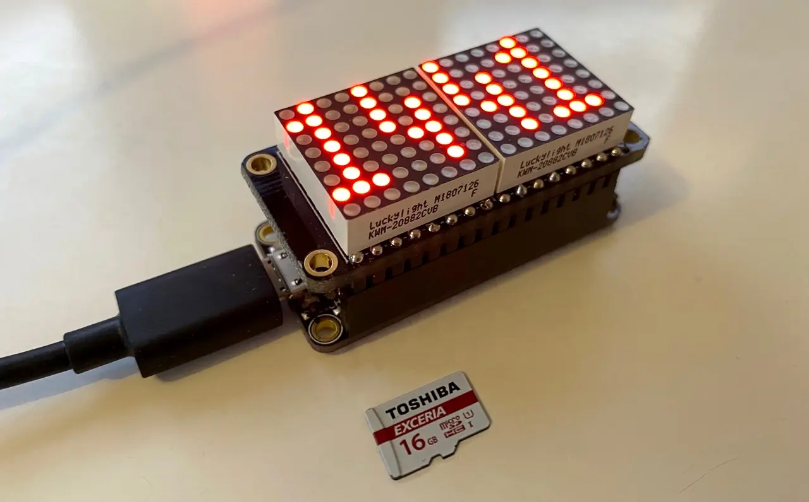

# FeatherClock 1.5.0

This repo contains code written for the [Adafruit Feather HUZZAH ESP32](https://www.adafruit.com/product/3405) (hence the name) and the [Raspberry Pi Pico W](https://datasheets.raspberrypi.com/picow/pico-w-datasheet.pdf), all running [MicroPython](http://micropython.org/). The Feather board requires the addition of female headers. Version 1.5.0 adds preliminary support for the [Adafruit Feather HUZZAH ESP32 V2](https://www.adafruit.com/product/5400).



The clock uses the [Adafruit FeatherWing](https://learn.adafruit.com/adafruit-7-segment-led-featherwings/overview) four-digit, seven-segment LED add-on — or any other HT16K33-based segment LED for that matter. You’ll want a non-FeatherWing display if you’re assembling a Pico W, for which you’re free to select any of its I2C pins. The Feather/FeatherWing combo requires specific pins, but the display assembly fits directly on top of the MCU board into a single, convenient unit. This is the version I use, for this very reason.

This code is an attempt to replicate my [Electric Imp clock project](https://github.com/smittytone/Clock). Currently, the clock has no remote control, which the Electric Imp Platform makes very easy to implement, but is rather less so here. You can [set preferences](#clock-settings), though. Adding a web UI, served locally or remotely, lies in a future phase of the project.

**Note** I previously supported the [Adafruit Feather HUZZAH ESP8266](https://www.adafruit.com/product/2821), but this is no longer the case: its RTC is poor and it has too little memory. If you are using this board, you can find the original, un-updated code in the [`archive`](/archive) directory. I will instead be focusing on boards that are more modern.

The code includes the option to alternate the clock with a readout of the current outdoor temperature. This requires the `prefs.json` file to be updated with additional keys, and this has been done with the sample file included here ([see **Clock Settings**, below](#clock-settings)). It is easy to turn off this feature if you don’t require it: change the value of the `show_temp` key to `false`, or comment out the line. By default, the clock **will not** enable this feature.

The temperature is collected from [Open Meteo](https://open-meteo.com/), which provides free access for low-volume, non-commercial applications. The code contains a basic Open Meteo integration class, which can be extracted and used elsewhere.

The current version of `featherclock` also includes the option to alternate the clock with a readout of the current day of the month and the month. This requires the `prefs.json` file to be updated with additional keys, and this has been done with the sample file included here ([see **Clock Settings**, below](#clock-settings)). It is easy to turn off this feature if you don’t require it: change the value of the `show_date` key to `false`, or comment out the line. By default, the clock **will** show the date.

## Installation

### Pre-requisites

To get your device's path, [install my utility `dlist`](https://github.com/smittytone/dlist). After restarting your terminal, you can run `dlist` to retrieve the path.

#### For ESP32 Boards

1. Install `pyboard.py` from [GitHub](https://github.com/micropython/micropython/blob/master/tools/pyboard.py).
    * Copy `pyboard.py` to a location accessible via your `$PATH` and rename it `pyboard`.
1. Install `esptool` using `brew install esptool` or `sudo apt install esptool`.
1. Download [the latest version of MicroPython](https://micropython.org/resources/firmware/ESP32_GENERIC-20260406-v1.28.0.bin).
    * If you are downloading for the **Adafruit Feather HUZZAH ESP32 V2**, make sure you [get the latest SPIRAM/WROVER version](https://micropython.org/resources/firmware/ESP32_GENERIC-SPIRAM-20260406-v1.28.0.bin).

#### For Pico W Boards

1. Install `pyboard.py` from [GitHub](https://github.com/micropython/micropython/blob/master/tools/pyboard.py).
    * Copy `pyboard.py` to a location accessible via your `$PATH` and rename it `pyboard`.
1. Download [the latest version of MicroPython for your board](https://micropython.org/download/?vendor=Raspberry%20Pi) and drop the `.uf2` file onto the mounted `RP2` drive.

### App Installation

#### Pre-requisites

1. Get the code and set up a Python virtual environment
    1. `git clone https://github.com/smittytone/FeatherClock`
    1. `cd FeatherClock`
    1. `python -m venv .python`
    1. `source .python/bin/activate`
    1. `pip3 install -r requirements.txt`
    1. Continue as below. Once complete, run `deactivate`

#### For ESP32 Boards

1. Connect your assembled FeatherClock (Feather plus LED add-on).
1. Update/install MicroPython:
        1. `esptool --chip esp32 --port $(dlist) erase-flash`
        1. `esptool --chip esp32 --port $(dlist) write-flash --baud 460800 -z 0x1000 /path/to/micropython/download.bin`
1. Run `./install.sh $(dlist)`
1. Press `E` for an ESP32 device.
1. Press `S` or `M` for your display type.
1. Press `2` if you have a Huzzah ESP32 V2, otherwise any other key.
1. Enter your WiFi SSID.
1. Enter your WiFi password.
1. After the code has copied, power-cycle your FeatherClock.

#### For Pico W Boards

1. Connect your assembled FeatherClock (Pico W plus HT16K33-based LED).
1. Update/install MicroPython:
    * Copy across (for example) `RPI_PICO_W-20250415-v1.25.0.uf2`
1. Run `./install.sh $(dlist)`
1. Press `W` for a Pico W.
1. Enter your WiFi SSID.
1. Enter your WiFi password.
1. After the code has copied, power-cycle your FeatherClock.

## Clock Settings

For now, the clock’s preferences are set by sending over a `prefs.json` file with the following values:

```json
{ "mode":   <true/false>,       # 24-hour (true) or 12-hour (false)
  "colon":  <true/false>,       # Show a colon between the hours and minutes readouts
  "flash":  <true/false>,       # Flash the colon symbol, if it's shown
  "bright": 10,                 # Display brightness from 1 (dim) to 15 (bright)
  "bst":    <true/false>,       # Auto-adjust for Daylight Saving Time
  "do_log": <true/false>,       # Write log data to the file `log.txt` on the device
  "show_date": <true/false>,    # Alternate clock with day and month readout
  "show_temp": <true/false>,    # Alternate clock with outside temperature
  "lat": float,                 # Your location, in latitude and longitude
  "lng": float
}
```

Having installed `pyboard.py` as above, you send over preferences file using:

```shell
pyboard -d $(dlist) -f cp prefs.json :prefs.json
```

However, the `install.sh` script does this for you, and allows you to enter your WiFi credentials

## To Do

- Web UI for clock settings control.

## Release History

- 1.5.0 *23 August 2026*
    - Add initial support for [Adafruit Feather HUZZAH ESP32 V2](https://www.adafruit.com/product/5400).
- 1.4.0 *18 July 2025*
    - Add local temperature readout to alternate with clock readout.
    - Add day and month readout to alternate with the clock readout (and temperature readout, if enabled).
    - Minimise MicroPython display memory allocations.
    - Bring the project up to date.
- 1.3.0 *24 January 2023*
    - Add experimental [Trinkey RP2040](https://www.adafruit.com/product/5056) version.
    - Better resilience to WiFi connection loss.
    - Better log file management.
    - Update to latest HT16K33 drivers.
    - Archive ESP8266 version.
- 1.2.3 *23 February 2022*
    - Better help in `install.sh`
    - Device-side errors now issued to log file.
    - Correct `pyboard` instructions.
- 1.2.2 *5 February 2022*
    - Style install script errors.
    - Update `esptool.py` installation instructions.
    - Add `dlist()` link.
    - No application code changes.
- 1.2.1 *13 September 2021*
    - Clarify installation instructions for ESP32 and ESP8266 boards.
    - Update install script.
    - No application code changes.
- 1.2.0 *26 August 2021*
    - Fix for post time-check pauses
    - Update `install.sh` to use MicroPython’s [`pyboard.py`](https://docs.micropython.org/en/latest/reference/pyboard.py.html).
    - Update `install.sh` to copy `prefs.json` over if it is present in the working directory.
- 1.1.0 *3 December 2020*
    - Revised code.
    - Matrix display version.
- 1.0.10 *19 November 2020*
    - Adds Feather Huzzah 32 version.
- 1.0.9 *29 September 2020*
    - Improve RTC time checks.
    - Improve installation script.
- 1.0.8 *6 September 2019*
    - Add installation script.
- 1.0.7 *25 April 2019*
    - Add optional on-device JSON prefs (`prefs.json`) loading.
- 1.0.6 *13 April 2019*
    - Add app preferences structure.
- 1.0.5 *10 April 2019*
    - Correct the months used for BST checking.
- 1.0.4 *9 April 2019*
    - Various linting-suggested code improvements.
- 1.0.3 *8 April 2019*
    - Improve RTC updates by making NTP checks.
- 1.0.2 *5 April 2019*
    - Add regular RTC updates.
- 1.0.1 *4 April 2019*
    - Add disconnection indicator to display.
    - Correct constant usage.
- 1.0.0 *3 April 2019*
    - Initial release.

### Licence ###

FeatherClock is copyright 2026, Tony Smith. It is released under the MIT licence.
